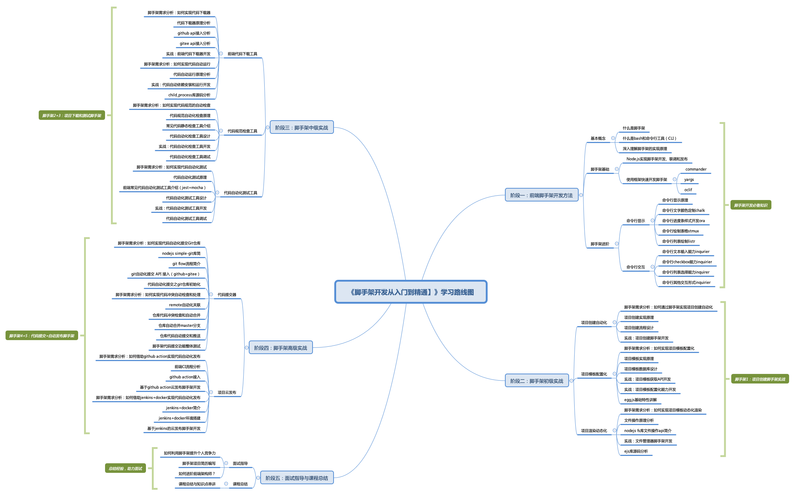

# 如何快速学会脚手架开发？

## 先回答以下两个问题
### 问题1：为什么要使用Node.js开发脚手架？
- JavaScript和TypeScript强大的语法特性
- Node.js具有强大的生态能够支持CLI的快速开发
  - 内置库，如：fs、path、os、child_process……
  - 三方库：如：commander、yargs、fs-extra、rxjs……

- Node.js具有强大的npm和yarn等包管理系统，可以快速完成CLI的发布和更新
  - 创建，npm init
  - 开发，npm scripts
  - 发布，npm publish
  - 应用，npm install

### 问题2：如何快速学会脚手架开发？
>  找到脚手架的应用场景，树立应用脚手架的信心

- 学习基础知识：学习Shell、Bash、CLI等操作系统的基础知识，牢固地掌握脚手架开发的底层原理；
- 掌握Node开发：根据脚手架开发需求，学习Node.js内置库、常用库、脚手架框架及各种命令行特有能力的开发方法（键盘输入、键盘监听、文本颜色、命令行交互等）；
- 开发提效工具：将学到的知识进行综合应用，开发脚手架工具，解决实际项目开发过程中的具体问题。

## 学习路线分解

## 脚手架学习和应用的五大阶段
- 阶段一：前端脚手架开发方法
- 阶段二：脚手架初级实战
- 阶段三：脚手架中级实战
- 阶段四：脚手架高级实战
- 阶段五：面试指导与课程总结
