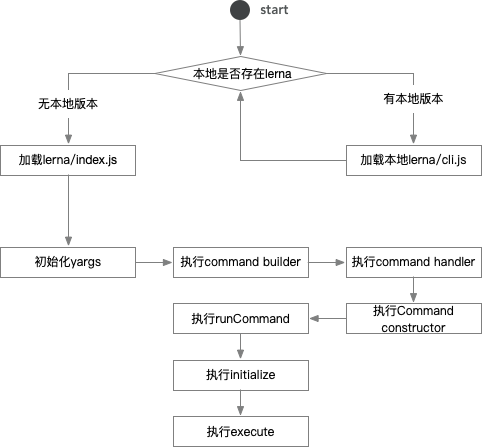

# npm workspaces 和 lerna 核心特性总结

## npm workspaces
### 创建项目

创建命令：
```bash
npm init --workspace a
```
或者
```bash
npm init -w a
```

项目创建后，会在项目顶级目录下创建 node_modules 并存储所有 package 的依赖：
```bash
node_modules
├── @samtestgroup
│   ├── imooc-test-a -> ../../a
│   └── imooc-test-cli -> ../../cli
```

### 安装依赖或更新依赖

为某个特定的 workspace 安装依赖
```bash
npm install chalk -w a
```
或者
```bash
npm install @samtestgroup/imooc-test-a -w cli
```

当修改了 package 的内容后（如：package.json 中的 name）

```bash
npm install --workspaces
```
或者
```bash
npm install -ws
```

-ws 会更新所有 workspace 的依赖

### 发布项目

发布全部项目：
```bash
npm publish -ws
```

## lerna 

### 初始化项目

```bash
npx lerna init
```

### 添加子项目

```bash
npx lerna create a
```

更多特性：
```bash
npx lerna create cli --access public --bin --es-module
```

### 添加依赖

安装依赖
```bash
npx lerna add chalk packages/a
npx lerna add @samtestgroup/lerna-test-a packages/cli
```

更新依赖
```bash
npx lerna bootstrap
```

### 自动化测试

```bash
npx lerna run test
```

### 项目发布

```bash
npx lerna publish
```

## lerna 执行流程

